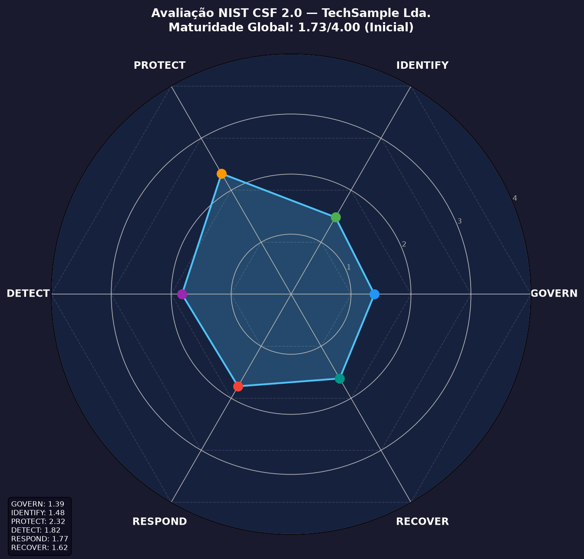

# nist-csf-assessment


**Avalie a maturidade de cibersegurança da sua organização face ao NIST CSF 2.0 e obtenha um relatório detalhado com gráfico radar em segundos — sem folhas de cálculo, sem ferramentas proprietárias.**

---

## Por que isto existe

As equipas de GRC (Governance, Risk & Compliance) passam horas a consolidar avaliações do NIST CSF em folhas de cálculo, produzindo relatórios inconsistentes e difíceis de versionar. Esta ferramenta trata a avaliação como **código**: o input é um ficheiro YAML versionável, o output é um relatório Markdown + gráfico radar PNG reproduzível a qualquer momento.

Casos de uso reais:
- Auditores internos que querem uma linha de base rápida antes de uma avaliação formal
- CISOs que precisam de apresentar a postura de segurança à administração
- Consultores que gerem múltiplos clientes e precisam de relatórios padronizados
- Equipas de DevSecOps que querem integrar avaliações de maturidade em pipelines CI/CD

> ⚠️ **Nota importante:** A estrutura de categorias e subcategorias do CSF 2.0 nesta ferramenta é uma aproximação com base na documentação pública disponível. **Deve ser verificada e validada face à fonte oficial do NIST: [nist.gov/cyberframework](https://www.nist.gov/cyberframework).** Não use esta ferramenta como substituto de uma avaliação formal certificada.

> **Framework structure based on NIST CSF 2.0 (6 functions, 22 categories, 106 subcategories). Verify against the official NIST CSF 2.0 Reference Tool at [nist.gov/cyberframework](https://www.nist.gov/cyberframework).**

---

## Saída gerada

A ferramenta produz três artefactos para cada avaliação:

| Ficheiro | Descrição |
|---|---|
| `assessment_report.md` | Relatório completo com scores por Função, Categoria e Subcategoria |
| `radar_chart.png` | Gráfico radar com as 6 Funções do CSF 2.0 |
| *(embutido no relatório)* | Lista priorizada de lacunas com remediação sugerida |

### Pré-visualização do Gráfico Radar



### Extrato do Relatório

```
| Função    | Média | Barra Visual |
|-----------|:-----:|--------------|
| GOVERN    | 1.43  | ███░░░░░░░   |
| IDENTIFY  | 1.76  | ████░░░░░░   |
| PROTECT   | 2.47  | ██████░░░░   |
| DETECT    | 1.91  | ████░░░░░░   |
| RESPOND   | 1.88  | ████░░░░░░   |
| RECOVER   | 1.63  | ████░░░░░░   |
```

---

## Instalação

```bash
# Clonar o repositório
git clone https://github.com/ericov/nist-csf-assessment.git
cd nist-csf-assessment

# Instalar dependências (apenas pyyaml e matplotlib)
pip install -r requirements.txt
```

---

## Utilização

```bash
python assess.py --input sample_input.yaml --output report/
```

| Argumento | Obrigatório | Descrição |
|---|:---:|---|
| `--input` | Sim | Ficheiro YAML com as pontuações da avaliação |
| `--output` | Sim | Diretório onde os ficheiros de saída serão escritos |

---

## Formato do Ficheiro de Input

O ficheiro YAML segue esta estrutura:

```yaml
organization: "Nome da Organização"
assessor: "Nome do Avaliador"
date: "2026-07-06"
scope: "Descrição do âmbito da avaliação"

scores:
  # Pontuação por subcategoria do CSF 2.0 (0-4)
  GV.OC-01: 3
  GV.RM-01: 2
  ID.AM-01: 3
  PR.AA-01: 4
  DE.CM-01: 2
  RS.MA-01: 1
  RC.RP-01: 2
  # ... todas as subcategorias relevantes
```

### Escala de Maturidade

| Pontuação | Nível | Descrição |
|:---:|---|---|
| 0 | Não Implementado | Sem práticas ou controlos implementados |
| 1 | Inicial | Práticas ad hoc, dependentes de indivíduos |
| 2 | Gerenciado | Práticas documentadas e repetíveis |
| 3 | Consistente | Práticas padronizadas e monitoradas |
| 4 | Otimizado | Melhoria contínua e benchmarking externo |

---

## Funções do NIST CSF 2.0

| Sigla | Função | Descrição |
|---|---|---|
| GV | **GOVERN** | Estabelecer e monitorizar a estratégia de gestão de risco cibernético |
| ID | **IDENTIFY** | Compreender os riscos de cibersegurança atuais da organização |
| PR | **PROTECT** | Usar salvaguardas para prevenir ou reduzir os riscos |
| DE | **DETECT** | Detetar e analisar possíveis ataques ou comprometimentos |
| RS | **RESPOND** | Agir face a um incidente de cibersegurança detetado |
| RC | **RECOVER** | Restaurar ativos e operações após um incidente |

---

## Exemplo de Saída Completa

O diretório [`examples/`](examples/) contém o output gerado a partir de `sample_input.yaml` (empresa de tecnologia de média dimensão, 150 colaboradores):

- [`examples/assessment_report.md`](examples/assessment_report.md) — Relatório completo
- [`examples/radar_chart.png`](examples/radar_chart.png) — Gráfico radar

---

## Estrutura do Projeto

```
nist-csf-assessment/
├── assess.py            # Script principal CLI
├── sample_input.yaml    # Input de exemplo (empresa média)
├── requirements.txt     # Dependências Python
├── LICENSE              # MIT License
└── examples/
    ├── assessment_report.md   # Relatório de exemplo gerado
    └── radar_chart.png        # Gráfico radar de exemplo gerado
```

---

## Dependências

- [`pyyaml`](https://pyyaml.org/) — Parsing do ficheiro de input
- [`matplotlib`](https://matplotlib.org/) — Geração do gráfico radar
- [`numpy`](https://numpy.org/) — Cálculos para o gráfico polar

---

## Licença

MIT © 2026 [Erico Virgy](https://github.com/ericov)

---

*Ferramenta de suporte à avaliação GRC. Não substitui uma avaliação formal certificada nem consultoria especializada em cibersegurança.*
